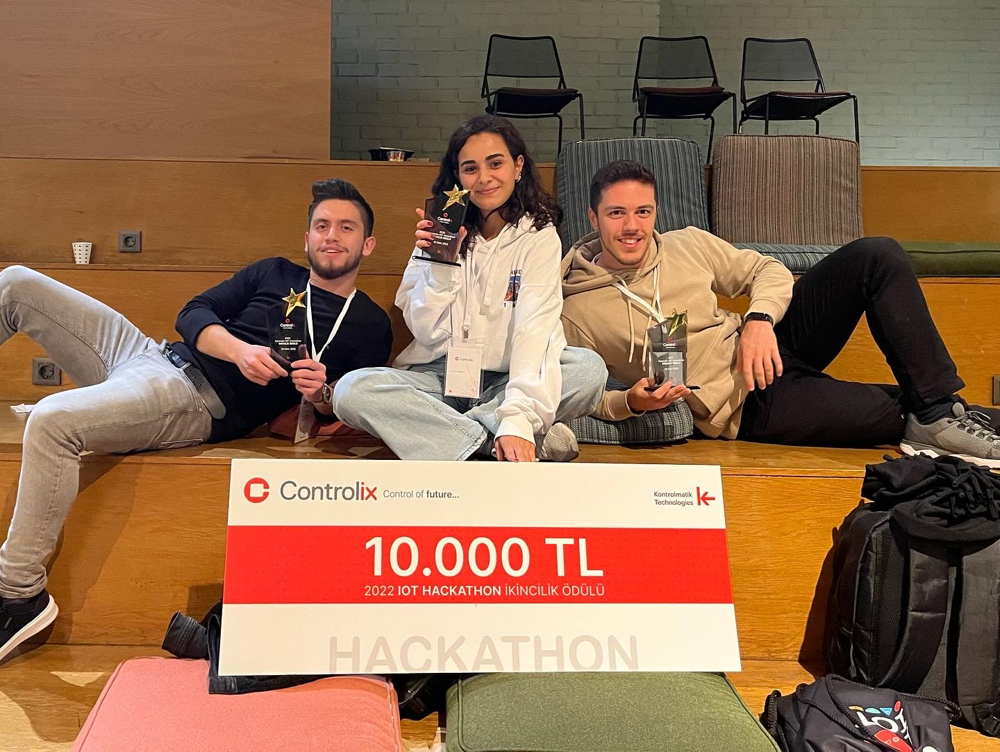

<h3 align="center">Controlix IOT Hackaton Second Place</h3>

  

In the hackathon with the theme of "Carsharing", we developed a project by working on the subject of "Instant and Operational Tracking" for 36 hours. The project developed a system where we can instantly monitor the data received from the sensors in the vehicle and take pictures of the driver when necessary. We have put forward a successful team work by producing different solutions to the different problems we experience.

